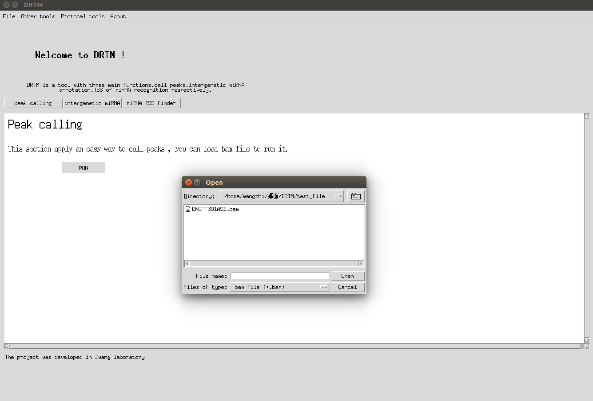
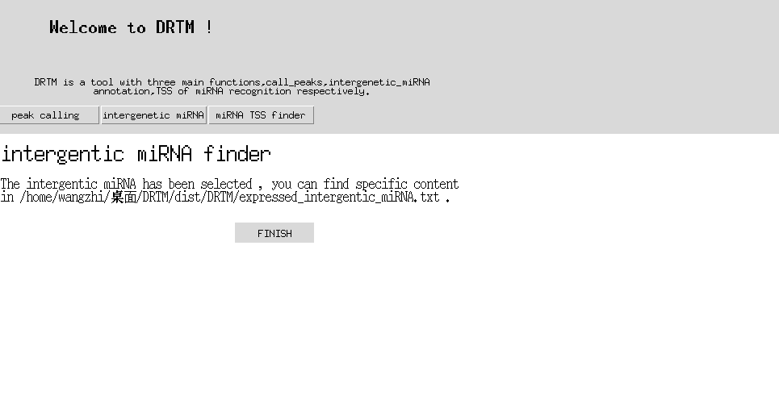
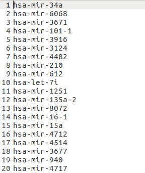
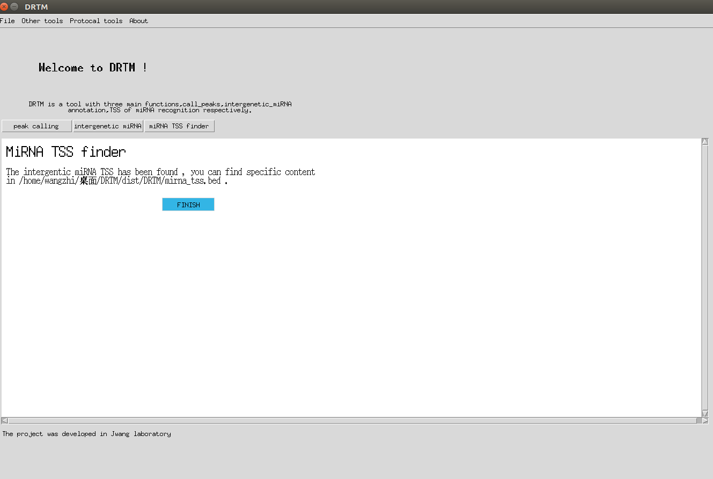

# DRTM
Deep recognization TSSs of miRNA
## Welcome to DRTM! 
DRTM is a convenient, fast running Linux GUI software, the main function of it is to find the expressed miRNA transcription start site. In addition, it can do a fast peak calling and find intergentic miRNA which is always confusing, the use of different combinations can complete a variety of functions. 
### 1 Peak calling 
Click the File drop-down menu, in the pop-up dialog box to import BAM file. Click the RUN button to generate the Peak file. The Peak file will be found in the software folder. 

### 2 intergenetic miRNA finder 
Press the interface intergenetic miRNA button to jump to a new interface , load the txt file like Peak calling , the programme will give you result quickly . Please pay attention to put your expressed miRNA to a txt file with only miRNA name ,or you the programme can't recognize it .

### 3 TSS finder
This part combines the first two steps with the Peak file and expressed intergenetic miRNA file, load the file with Peak suffix, press the RUN button, the results will be stored in the software directory . We suggest using macs developed by TaoLiu to get your Peaks will get better TSS results for miRNAS. (please download hg19.fa genome and put it into 'pre_loaded_file' folder.）

Thank you for your use, you can achieve interesting features with different combination . DRTM was developed in Jwang's lab . 
